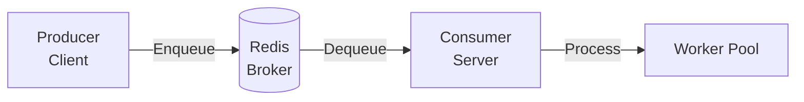
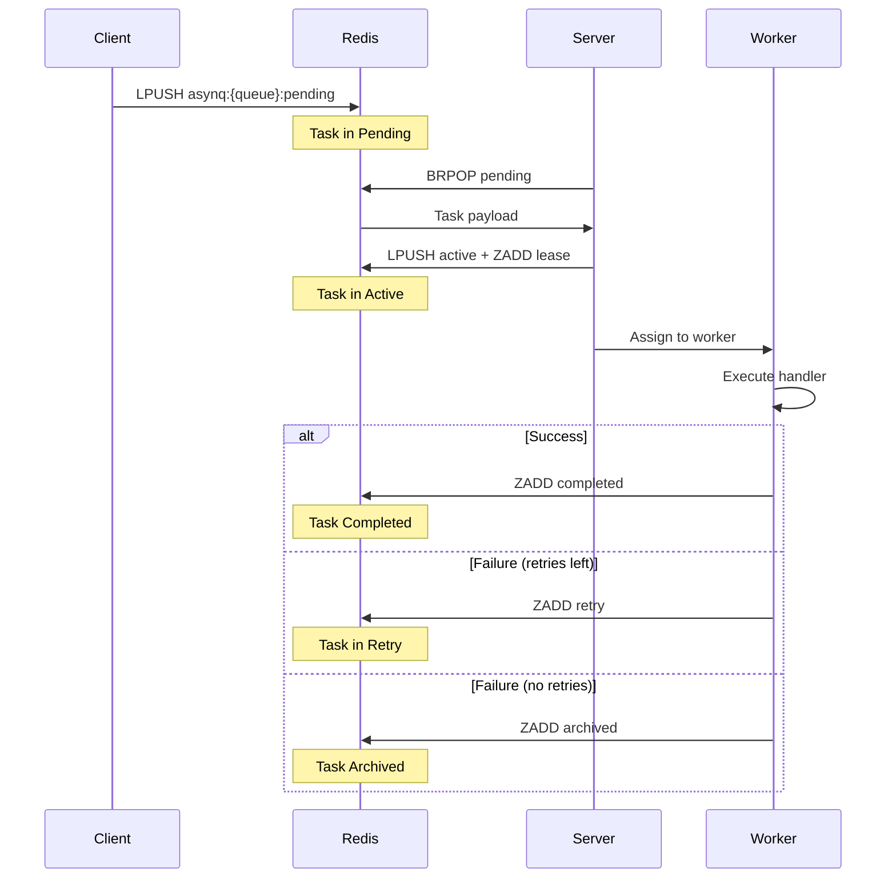

# TitanQueue Architecture

## High-Level Architecture

TitanQueue follows the **Producer-Broker-Consumer** pattern.



### Components

| Component       | Role     | Description                              |
| --------------- | -------- | ---------------------------------------- |
| **Client**      | Producer | Enqueues tasks to Redis queues           |
| **Redis**       | Broker   | Stores tasks in lists & sorted sets      |
| **Server**      | Consumer | Orchestrates workers and background jobs |
| **Worker Pool** | Executor | Concurrent goroutines executing handlers |

---

## Task Lifecycle



---

## Server Components

| Component         | File             | Purpose                                      |
| ----------------- | ---------------- | -------------------------------------------- |
| **Processor**     | `processor.go`   | Worker pool that dequeues and executes tasks |
| **Forwarder**     | `forwarder.go`   | Moves scheduled/retry tasks to pending       |
| **Recoverer**     | `recoverer.go`   | Re-queues tasks from crashed workers         |
| **Heartbeater**   | `heartbeat.go`   | Extends task leases, writes server state     |
| **Syncer**        | `syncer.go`      | Retries failed Redis write operations        |
| **Subscriber**    | `subscriber.go`  | Listens for task cancellation via PubSub     |
| **Janitor**       | `janitor.go`     | Cleans up expired completed tasks            |
| **Healthchecker** | `healthcheck.go` | Monitors Redis connection health             |

---

## Redis Data Structures

| Key Pattern               | Type       | Purpose                                        |
| ------------------------- | ---------- | ---------------------------------------------- |
| `asynq:queues`            | Set        | List of all queue names                        |
| `asynq:{queue}:pending`   | List       | Tasks waiting to be processed                  |
| `asynq:{queue}:active`    | List       | Tasks currently being processed                |
| `asynq:{queue}:scheduled` | Sorted Set | Tasks scheduled for future (score = timestamp) |
| `asynq:{queue}:retry`     | Sorted Set | Failed tasks waiting for retry                 |
| `asynq:{queue}:archived`  | Sorted Set | Permanently failed tasks                       |
| `asynq:{queue}:completed` | Sorted Set | Successfully completed tasks                   |
| `asynq:{queue}:lease`     | Sorted Set | Task leases (score = expiry time)              |
| `asynq:{queue}:t:{id}`    | Hash       | Task data (msg, state, timeout, etc.)          |

---

## Priority Queue Processing

TitanQueue supports weighted priority queues:

```go
Queues: map[string]int{
    "critical": 6,  // 60% of processing time
    "default":  3,  // 30% of processing time
    "low":      1,  // 10% of processing time
}
```

In **weighted mode** (default), queues are selected randomly based on weight.
In **strict mode** (`StrictPriority: true`), higher priority queues are always checked first.

---

## Crash Recovery

1. **Lease Expiry**: Each active task has a lease (default 30s)
2. **Heartbeater**: Workers extend leases every 10s while processing
3. **Recoverer**: Scans for expired leases every minute
4. **Recovery**: Expired tasks are moved back to `pending` or `archived`
